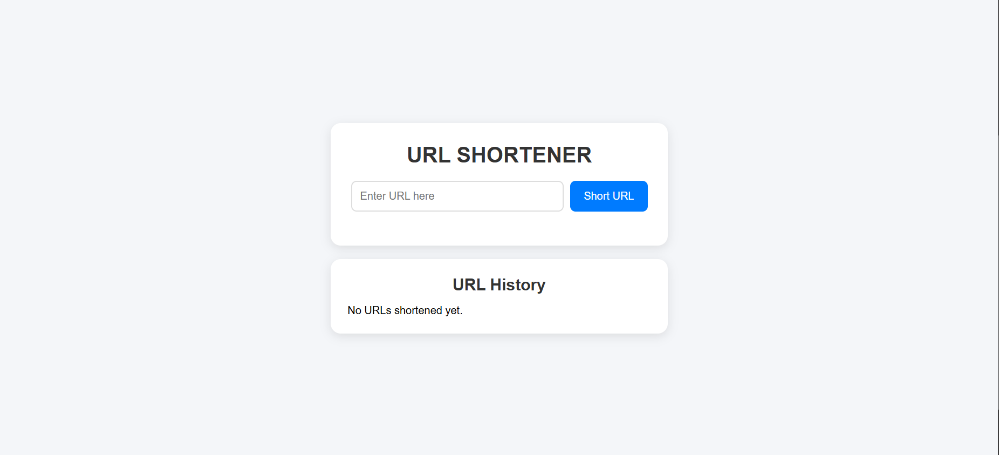
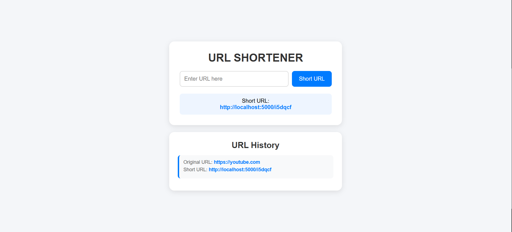

# URL Shortener

A simple URL Shortener built with Flask and Python.

This project allows users to convert long URLs into short, easy-to-share links. When a shortened URL is visited, the application automatically redirects the user to the original website.

  Features

* Generate unique short URLs
* Automatic redirection to original URLs
* URL history display
* Duplicate ID prevention
* Automatic `https://` handling for URLs without a protocol
* Clean and responsive user interface

  Tech Stack

* Python
* Flask
* HTML
* CSS

  Project Structure


url-shortener/
│
├── app.py
├── templates/
│   └── index.html
│
└── README.md


  Screenshots

 # Home Page


 # URL History


  Installation

1. Clone the repository

```bash
git clone https://github.com/your-username/url-shortener.git
```

2. Move into the project directory

```bash
cd url-shortener
```

3. Install Flask

```bash
pip install flask
```

4. Run the application

```bash
python app.py
```

5. Open your browser and visit

```text
http://localhost:5000
```

  How It Works

1. User enters a long URL.
2. The application generates a random 6-character unique ID.
3. The original URL and generated ID are stored in memory.
4. A shortened URL is created.
5. When the short URL is visited, Flask finds the matching original URL and redirects the user.

 # Example

Original URL:

```text
https://www.google.com
```

Generated Short URL:

```text
http://localhost:5000/abc123
```

Visiting the short URL redirects the user to:

```text
https://www.google.com
```

  Future Improvements

* SQLite database integration
* Click analytics
* URL expiration
* Custom short links
* Copy-to-clipboard button
* User authentication

  Learning Outcomes

This project helped practice:

* Flask Routing
* Dynamic URLs
* Form Handling
* Redirects
* Python Data Structures
* Basic Web Development

  License

This project is open-source and available for learning and educational purposes.
